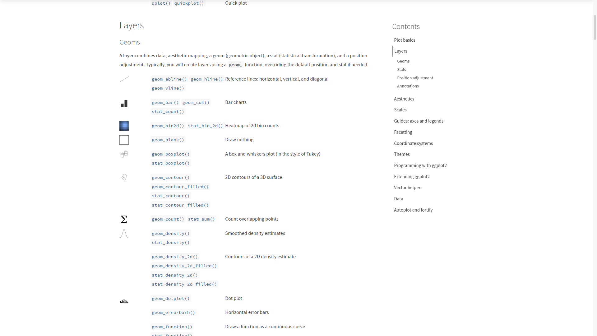
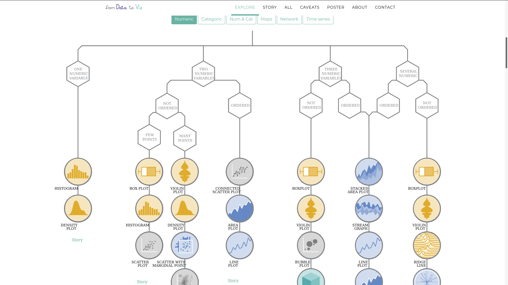

```{r setup, include=FALSE}
library(learnr)
knitr::opts_chunk$set(echo = TRUE, message = FALSE, warning = FALSE)
library(knitr)
library(kableExtra)
library(ggplot2)
library(palmerpenguins)
library(tibble)
library(DT)
library(dplyr)
library(lubridate)
library(sf)
library(flair)
stringency_index <- read.csv("https://raw.githubusercontent.com/MaelTheuliere/atelier/master/inst/extdata/stringency_index.csv") %>% 
  mutate(Date = ymd(Date))
```

## Introduction 

Bienvenue sur cet atelier de découverte de ggplot2.

Vous allez dans les 2h qui viennent : 

- comprendre la logique de [The Grammar of Graphics (Statistics and Computing)](https://www.springer.com/fr/book/9780387245447)
- comprendre à faire des premiers graphiques en ggplot2
- découvrir les différentes valorisations possibles avec ggplot2
- faire des cartes avec ggplot2
- travailler sur des pingouins et du COVID 19 ;-)


## Configuration

Merci d'installer les packages suivants pour suivre ce tutoriel

```{r, echo = T,eval = F}
install.packages("knitr")
install.packages("kableExtra")
install.packages("ggplot2")
install.packages("palmerpenguins")
install.packages("dplyr")
install.packages("tibble")
install.packages("DT")
install.packages('lubridate')
install.packages("sf")
```

```{r, echo = T, eval = F}
library(knitr)
library(kableExtra)
library(ggplot2)
library(palmerpenguins)
library(tibble)
library(dplyr)
library(DT)
library(lubridate)
library(sf)
```

## Présentation de ggplot2

- [ggplot2](http://ggplot2.tidyverse.org/) est un package créé par Hadley Wickham et Winston Chang pour implémenter dans R la vision développée par Leland Wilkinson dans  [The Grammar of Graphics (Statistics and Computing)](https://www.springer.com/fr/book/9780387245447) de la conception de graphiques.

- Le but est de fournir une approche unique pour produire quasiment **toute valorisation graphique** de données que l'on peut trouver dans des revues scientifiques, les journaux, dans l'analyse statistique ou la data visualisation.

- Ce package s'inscrit aujourd'hui dans R par le **framework tidyverse** qui propose une approche cohérente entre l'importation et la préparation des données, leur analyse et leur valorisation.


{#id .class width=800}

## Présentation des datasets

### Palmer Penguins

Le dataset palmerpenguins contient des mesures de tailles pour 3 espèces de pingouin observées sur 3 îles de l'[archipel Palmer en Antarxtique](https://fr.wikipedia.org/wiki/Archipel_Palmer)

{width=800}

Les pingouins de l'archipel de Palmer. Artwork by [@allison_horst](https://www.github.com/allisonhorst).

Ces données ont été collectées entre 2007 et 2009 par Docteur Dr. Kristen Gorman avec le [programme de recherche écologique à long terme de la station Palmer](https://pal.lternet.edu/), une partie du [réseau de recherche écologique à long terme des Etats Unis](https://lternet.edu/). 

Elles ont été mises dans un package R [palmerpenguins](https://allisonhorst.github.io/palmerpenguins/) par Allison Horst et Alison Hill.
Le dataset `palmerpenguins::penguins` contient 8 variables sur 344 pingouins (dont 333 observations complètes). Pour obtenir plus d'info sur les variables, vous pouvez taper `?penguins`.

```{r}
glimpse(penguins)
```

Le tableau de données se présente de la façon suivante :

```{r eval=TRUE, include=TRUE, echo=FALSE}
# Structure du tableau de données :
datatable(penguins[1:10,], rownames = FALSE, options = list(pageLength = 5, autoWidth = TRUE, scrollX = TRUE))

```

Les données sont diffusées sous la licence CC0 license (“No Rights Reserved”) en accord avec la [politique data de la station Palmer](https://pal.lternet.edu/data/policies).

Citation recommandée pour le dataset : *Gorman KB, Williams TD, Fraser WR (2014) Ecological Sexual Dimorphism and Environmental Variability within a Community of Antarctic Penguins (Genus Pygoscelis). PLoS ONE 9(3): e90081. https://doi.org/10.1371/journal.pone.0090081*

Citation recommandée pour le package : *Horst AM, Hill AP, Gorman KB (2020). palmerpenguins: Palmer Archipelago (Antarctica) penguin data. R package version 0.1.0. https://allisonhorst.github.io/palmerpenguins/. doi: 10.5281/zenodo.3960218.*

### Oxford COVID-19 Government Response Tracker (OxCGRT)

L'[OxCGRT](https://www.bsg.ox.ac.uk/research/research-projects/coronavirus-government-response-tracker) est un projet de la [Blavatnik School of Government](https://www.bsg.ox.ac.uk/) (Université d'Oxford). Il implique une centaine de membres qui mettent à jour en continu une base de données de [17 indicateurs](https://github.com/OxCGRT/covid-policy-tracker/blob/master/documentation/codebook.md) sur les réponses gouvernementales pour faire face à la pandémie de la COVID-19.

Ces indicateurs reflètent les politiques d'endiguement telles que les fermetures d'écoles, des lieux de travail, des transports publics, les politiques de confinement ou encore l'annulation d'événements publics. Un indice de rigueur ([*Stringency Index*](https://github.com/OxCGRT/covid-policy-tracker/blob/master/documentation/index_methodology.md)) s'étalant de 0 à 100 est ensuite calculé à partir de ces 17 indicateurs. Il reflète, selon ses créateurs, le niveau de rigueur des gouvernements (et son évolution) pour faire face à la pandémie.

<iframe src="https://ourworldindata.org/grapher/covid-stringency-index?time=2020-05-07..2020-09-29" loading="lazy" style="width: 100%; height: 600px; border: 0px none;"></iframe>

<br>

Chaque indicateur est calculé quotidiennement depuis le 1er janvier 2020, pour l'ensemble des pays du Monde. La base de données complète est disponible [ici](https://raw.githubusercontent.com/OxCGRT/covid-policy-tracker/master/data/OxCGRT_latest.csv).


Pour cet atelier, nous travaillerons sur une extraction de ce jeu de données :    
- La période de temps a été réduite du 1er février au 30 juin 2020    
- L'extraction ne comporte que les données sur les pays de l'Union Européenne à 28 (GBR inclus)     
- Certaines variables ont été supprimées pour simplifier le tableau   

Vous pouvez télécharger l'extraction via ce [lien](https://raw.githubusercontent.com/MaelTheuliere/atelier/master/inst/extdata/stringency_index.csv), et/ou directement la charger dans R en utilisant son URL d'accès :


```{r eval=FALSE}
stringency_index <- read.csv("https://raw.githubusercontent.com/MaelTheuliere/atelier/master/inst/extdata/stringency_index.csv")
```

Par défaut ici notre variable date n'est pas au bon format, on doit la convertir avec les fonctions du package [`{lubridate}`](https://lubridate.tidyverse.org/) : 

```{r}
stringency_index <- stringency_index %>% 
  mutate(Date = ymd(Date))
```

<br>

Le tableau de données se présente de la façon suivante :

```{r eval=TRUE, include=TRUE, echo=FALSE}
# Structure du tableau de données :
datatable(stringency_index[1:10,], rownames = FALSE, options = list(pageLength = 5, autoWidth = TRUE, scrollX = TRUE))
```

<br>

L'utilisation de ces données est soumise à la licence [Creative Commons Attribution CC-BY](https://creativecommons.org/licenses/by/4.0/deed.fr).  

Citation recommandée: *Hale, Thomas, Noam Angrist, Emily Cameron-Blake, Laura Hallas, Beatriz Kira, Saptarshi Majumdar, Anna Petherick, Toby Phillips, Helen Tatlow, Samuel Webster (2020). Oxford COVID-19 Government Response Tracker, Blavatnik School of Government.* 


## Les concepts clefs

Pour construire un graphique avec ggplot2, il faut définir plusieurs éléments : 

- **la donnée** : ggplot2 permet de travailler sur des vecteurs, des dataframes, des tibbles, ou des données spatiales ;

- le **mapping** : on définit dans l'aesthetic (ou aes) le **mapping**, c'est à dire ce que l'on veut représenter qui **dépend des variables** (quelle variable sur l'axe x, sur l'axe y, quelle variable pour définir une graduation de couleurs...) ;

- les **paramètres** : on définit les autres paramètres qui dépendent de constantes (par exemple : je veux que toutes mes lignes soient rouge ou de taille 2 pixels) ;

- le **layer ("forme géométrique")** : on définit sous quelle représentation graphique on représente les paramètres précédents. Sous `ggplot`, ces fonctions sont de la forme `geom_XX` ;

L'écriture type d'un graphique est donc: 

```{r, echo=T,eval=F}
ggplot(data = <DATA>) + 
  <FORME_GEO>(mapping = aes(<MAPPINGS>),...=<PARAMS>)
```

On va ensuite pouvoir enrichir avec des fonctions supplémentaires.
Chaque fonction s'enchaine avec des `+` comme les pipe.

```{r, echo=T,eval=F}
ggplot(data = <DATA>) + 
  <FORME_GEO>(mapping = aes(<MAPPINGS>),...=<PARAMS>)+
  <FONCTION1>+
  ...
```


## Le mapping

### Les paramètres du mapping

Dans l'exemple qui suit, la représentation géographique utilisée est le nuage de points **geom_point**.
D'autres types de représentations géographiques sont présentés dans la partie suivante.

L'aesthetic sert à identifier les variables que l'on souhaite représenter.
Par exemple, si l'on souhaite représenter la longueur de la nageoire en fonction du poids des pingouins :

```{r, fig.height=3.5}
ggplot(data = penguins, aes(x = flipper_length_mm, y = body_mass_g)) +
  geom_point()
```

De plus, la fonction **aes** admet d'autres arguments qui permettent de modifier l'apparence du graphique selon une 3ème variable du jeu de données. Par exemple : 

- **colour** : la couleur,
- **shape** : la forme,
- **size** : la taille,
- **alpha** : la transparence,
- **fill** : le remplissage ;

```{r, fig.height=3.5}
ggplot(data = penguins) +
  geom_point(aes(x = flipper_length_mm, 
                            y = body_mass_g,
                            color = species,
                            shape = species)
             )
```

### Les "autres" paramètres

Il est possible de spécifier des paramètres qui seront valables pour l'ensemble du graphique. 
On retrouve entre autre les mêmes paramètres proposés dans l'aes, mais il faut alors les passer **en dehors de l'aesthetic**.

Par exemple, si l'on souhaite modifier la transparence et la taille de l'ensemble des points du graphique précédent, et que notre couleur soit une constante :

```{r, fig.height=3.5}
ggplot(data = penguins) +
  geom_point(aes(x = flipper_length_mm, 
                            y = body_mass_g,
                            shape = species),
                            color = "deepskyblue2",
             size = 2,
             alpha = 0.7)
```

Pour choisir et modifier facilement les couleurs d'un graphique, il existe un addin développé par Dean Attali: **Colour Picker**
Il est installable comme n'importe quel package.
Pour plus d'informations: https://github.com/daattali/colourpicker


## Enrichir votre graphique

### Rajouter un titre ou des libellés

Nous utilisons la fonction `labs()` qui permet de labelliser tous les éléments possibles de l’aesthétic, ainsi que le titre (***title***), le sous titre (***subtitle***) et le bas de page (***caption***). Nous pouvons via l'instruction `labs()` modifier aussi les libellés des axes et le titre de la légende en nommant les variables présentes dans *l'aesthetic*

```{r}
ggplot(data = penguins) +
  geom_point(aes(x = flipper_length_mm, 
                            y = body_mass_g,
                            color = species,
                            shape = species),
             size = 2,
             alpha = 0.7) +
 labs(title = "Penguin size, Palmer Station LTER",
       subtitle = "Flipper length and body mass for Adelie, Chinstrap and Gentoo Penguins",
      caption = "Gorman KB, Williams TD, Fraser WR (2014)",
       x = "Flipper length (mm)",
       y = "Body mass (g)",
       color = "Penguin species",
       shape = "Penguin species")
```

### Modifier le thème

Plusieurs thèmes par défaut existent dans ggplot 2 vous permettant d'ajuster l'apparence de votre graphique. La liste des themes disponibles se trouve sur le [site du package](https://ggplot2.tidyverse.org/reference/ggtheme.html)

```{r}
ggplot(data = penguins) +
  geom_point(aes(x = flipper_length_mm, 
                            y = body_mass_g,
                            color = species,
                            shape = species),
             size = 2,
             alpha = 0.7) +
  theme_minimal()+
 labs(title = "Penguin size, Palmer Station LTER",
       subtitle = "Flipper length and body mass for Adelie, Chinstrap and Gentoo Penguins",
      caption = "Gorman KB, Williams TD, Fraser WR (2014)",
       x = "Flipper length (mm)",
       y = "Body mass (g)",
       color = "Penguin species",
       shape = "Penguin species")
```


## A vous de jouer !

Prenez le dataset `penguins` et réaliser un nuage de point des pinguouins avec : 

- en abscisse la longueur du bec `bill_length_mm`
- en ordonnée l'épaisseur du bec  `bill_depth_mm`
- une forme des points en fonction de l'espèce `species`


```{r firstggplot, exercise=TRUE, exercise.lines = 10}

```

```{r firstggplot-solution}
ggplot(data = penguins) +
  geom_point(aes(x = bill_length_mm, 
                            y = bill_depth_mm,
                            shape = species)
             )
```

Prenez le graphique précédent, et rajouter : 

- une couleur en fonction du sexe `sex`
- une taille des points à 2.2
- une transparence à 0.5
- un thème, un titre, un sous titre et des libellés

```{r secondggplot, exercise=TRUE, exercise.lines = 10}

```

```{r secondggplot-solution}
ggplot(data = penguins) +
  geom_point(aes(x = bill_length_mm, 
                            y = bill_depth_mm,
                            color = sex,
                            shape = species),
             size = 2.2,
             alpha = 0.5)+
    theme_minimal() +
  labs(title = "Penguin bill dimensions",
       subtitle = "Bill length and depth for Adelie, Chinstrap and Gentoo Penguins at Palmer Station LTER",
      caption = "Gorman KB, Williams TD, Fraser WR (2014)",
       x = "Bill length (mm)",
       y = "Bill depth (mm)",
       color = "Penguin species",
       shape = "Penguin species") 
```

## Les différents layers possibles

Vous avez deux moyens pour explorer les différentes formes de valorisations (layers) possibles avec R.

:::: {style="display: flex;"}
::: {}
Le site de [ggplot2](https://ggplot2.tidyverse.org/reference/index.html#section-layers) vous donne accès à l'ensemble des ***layers*** possibles et vous donne plusieurs exemples d'utilisation, vous donne aussi les paramètres possibles dans l'aes de chacun.
:::
::: {}
{width=400}
:::
::::

:::: {style="display: flex;"}
::: {}
{width=400}
:::
::: {}
Le site [from data to viz](https://www.data-to-viz.com/) vous permet d'avoir une entrée en fonction des ***type de données*** que vous souhaitez valoriser
:::
::::

## A vous de jouer !

A partir des sites précédents, refaire les graphiques suivants.

### Diagramme barre

https://www.r-graph-gallery.com/barplot

```{r, echo = F}
ggplot(penguins) +
  geom_bar(aes(x = island, fill = species), alpha = 0.8) + 
  theme_minimal()
  labs(x = "Island",
       y = "Frequency",
       title = "Penguin location")
```


```{r geom_bar, exercise=TRUE, exercise.lines = 10}

```

```{r geom_bar-solution}
ggplot(penguins) +
  geom_bar(aes(x = island, fill = species), alpha = 0.8) + 
  theme_minimal()
  labs(x = "Island",
       y = "Frequency",
       title = "Penguin location")
```

### Histogramme

https://www.r-graph-gallery.com/histogram

```{r, echo = F}
ggplot(data = penguins) +
  geom_histogram(aes(x = flipper_length_mm,
                     fill = species),
                 alpha = 0.5,
                 position = "identity")+
  labs(x = "Flipper length (mm)",
       y = "Frequency",
       title = "Penguin flipper lengths")+
  theme_minimal()
```


```{r geom_histogram, exercise=TRUE, exercise.lines = 10}

```
```{r geom_histogram-solution}
ggplot(data = penguins) +
  geom_histogram(aes(x = flipper_length_mm,
                     fill = species),
                 alpha = 0.5,
                 position = "identity")+
  
  labs(x = "Flipper length (mm)",
       y = "Frequency",
       title = "Penguin flipper lengths")+
  theme_minimal()
```

### box plot

https://www.r-graph-gallery.com/boxplot

```{r, echo = F}
ggplot(data = penguins) +
  geom_boxplot(aes(x = species, y = flipper_length_mm,color = species), width = 0.3, show.legend = FALSE) +
  theme_minimal() +
  labs(x = "Species",
       y = "Flipper length (mm)") +
  theme_minimal() +
  labs(x = "Body mass (g)",
       y = "Frequency",
       title = "Penguin body mass")
```

```{r geom_boxplot, exercise=TRUE, exercise.lines = 10}

```

```{r geom_boxplot-solution}
ggplot(data = penguins) +
  geom_boxplot(aes(x = species, y = flipper_length_mm,color = species), width = 0.3, show.legend = FALSE) +
  theme_minimal() +
  labs(x = "Species",
       y = "Flipper length (mm)") +
  theme_minimal() +
  labs(x = "Body mass (g)",
       y = "Frequency",
       title = "Penguin body mass")
```


## Enchainer plusieurs layer

Quittons nos penguins pour retrouver notre dur quotidien dans un monde sous covid-19 pour voir comment `{ggplot}` permet d'enchainer plusieurs layers.

Prenons ici le graphique de l'évolution du nombre de morts en France : 

```{r geom_line_1}
stringency_index %>% 
  filter(CountryName == "France") %>% 
  ggplot()+
  geom_line(aes(x = Date,y=ConfirmedDeaths),color = 'dark red')
```

Pour rajouter à ce graphique celle du nombre de cas confirmés, je peux rajouter un nouveau `geom_line()` :

```{r, geom_line_2, include = FALSE}
stringency_index %>% 
  filter(CountryName == "France") %>% 
  ggplot()+
  geom_line(aes(x = Date,y=ConfirmedDeaths),color = 'dark red')+
  geom_line(aes(x = Date,y=ConfirmedCases),color = 'red')
```

```{r flair-geom_line_2, echo = FALSE}
decorate("geom_line_2") %>% 
  flair("+
  geom_line(aes(x = Date,y=ConfirmedCases),color = 'red')")
```

## A vous de jouer !

Reproduire le graphique précédent pour la Grande Bretagne

```{r geom_line_it, exercise=TRUE, exercise.lines = 10}

```

```{r geom_line_it-solution}
stringency_index %>% 
  filter(CountryName == "Italy") %>% 
  ggplot()+
  geom_line(aes(x = Date,y=ConfirmedDeaths),color = 'dark red')+
  geom_line(aes(x = Date,y=ConfirmedCases),color = 'red')
```

Reproduire le graphique précédent pour 4 pays différents : Allemagne, Espagne, France, Italie, avec la couleur pour identifier les pays et la forme du trait pour différencier les deux indicateurs.

```{r geom_line_4pays, exercise=TRUE, exercise.lines = 10}

```

```{r geom_line_4pays-solution}
stringency_index %>% 
  filter(CountryName %in% c("Germany","France", "Italy","Spain")) %>% 
  ggplot()+
  geom_line(aes(x = Date,y=ConfirmedDeaths,color = CountryName),linetype=2)+
  geom_line(aes(x = Date,y=ConfirmedCases,color = CountryName),linetype=1)
```

## Les graphiques à facette

Les graphiques à facette ou "small multiple" permettent de mettre en lumière la façon dont un phénomène va différer suivant les valeurs d'une variable catégorielle.

La fonction `facet_wrap()` de `{ggplot2}` permet de réaliser des facettes en R.

Prenons l'exemple précédent, nous allons pouvoir réaliser un graphique à facettes sur l'ensemble des pays de notre jeux de donnée de cette façon

```{r facet, fig.width = 9, fig.height=8, include = FALSE}
stringency_index %>% 
  ggplot()+
  geom_line(aes(x = Date,y=ConfirmedDeaths,color = CountryName),linetype=2) +
  geom_line(aes(x = Date,y=ConfirmedCases,color = CountryName),linetype=1) +
  facet_wrap(~CountryName) +
  theme(legend.position = 'none')
```

```{r facet-flair, echo = FALSE}
decorate("facet") %>% 
  flair("facet_wrap(~CountryName) +")
```

## Les cartes

### Les fonds de carte en R

`{ggplot2}` permet également de faire des cartes, qui devient un layer comme un autre.

La première chose dont on a besoin pour faire des cartes est un fond de carte ou composante spatiale à rajouter à nos données. Ici en l'ocurence nous avons besoin des polygones traçant le contour de nos pays. Pour gérer la composante spatiale vectorielle d'une donnée, le package de référence dans R est aujourd'hui `{sf}`. Nous avons préparé ici un fond de carte spécifique à nos données covid sur les pays de l'union européenne.

```{r}
ue <- read_sf("https://raw.githubusercontent.com/leakyMirror/map-of-europe/master/GeoJSON/europe.geojson") %>% 
  select(ISO3,NAME,POP2005)
```

```{r}
kable(ue) %>% 
  kable_material()
```

On peut remarquer que ce dataset est un peu spécial

- il est de classe `sf` et pas seulement `data.frame`
- il possède une colonne `geometry` d'un nouveau type  `sfc_POLYGON`
- il possède des métadonnées propres aux données spatiales : crs, bbox, dimension, type de géométrie

```{r}
class(ue)
head(ue)
```

Et l'utilisation de la fonction  `plot()` permet de visualiser nos données

```{r}
plot(ue)
```

Si on veut utiliser `{ggplot2}` on va utiliser une fonction spécifique `geom_sf()`

```{r}
ggplot(data = ue) +
  geom_sf()
```

Pour visualiser nos données covid,il va falloir apparier nos données spatiales avec nos données brutes afin de les visualiser sur une carte :

```{r}
stringency_index_wgs84<- ue %>% 
  inner_join(stringency_index,by=c("ISO3"="CountryCode"))
```

### Les carte choroplèthe

On va pouvoir utiliser notre table `stringency_index_wgs84` pour par exemple réaliser une carte choroplèthe, ici sur le nombre de morts pour 10000 habitants.

```{r}
stringency_index_wgs84 %>% 
  filter(Date == '2020-03-31') %>% 
  ggplot() +
    geom_sf(aes(fill = ConfirmedDeaths*10000/POP2005)) + 
    labs(title = "Nombre de morts pour 10 000 habitants au 31 mars",
       fill = NULL)
```

### Les cartes en ronds proportionnels

Pour visualiser un nombre de mort, qui est une données en volumne, on va devoir réaliser une carte en ronds proportionnels.

On va coupler à notre fond de carte obtenu avec `geom_sf()` la fonction `stat_sf_coordinates()` qui permet de réaliser un centroid : 

```{r map_ggplot,fig.width = 8,fig.height =8}
stringency_index_wgs84 %>% 
  filter(Date=="2020-03-31") %>% 
  ggplot() +
  geom_sf() +
  stat_sf_coordinates(aes(size = ConfirmedDeaths),shape=21) +
  theme_void() +
  labs(title = "Nombre de morts du covid au 31 mars")
```

Pour en faire une carte difusable, il faut ensuite un peu de style : 

```{r map_ggplot_theme, include = FALSE,fig.width = 8,fig.height =8}
stringency_index_wgs84 %>% 
  filter(Date=="2020-03-31") %>% 
  ggplot() +
  geom_sf(fill='#e5e5e5',color='white') +
  stat_sf_coordinates(aes(size = ConfirmedDeaths),shape=21,color='white',fill='red',alpha = .2) +
  scale_size(range = c(1,30)) +
  theme_void() +
  theme(legend.position = 'top')+
  labs(title = "Nombre de morts du covid au 31 mars",size = NULL)
```

```{r map_ggplot_theme-flair, echo = FALSE,fig.width = 8,fig.height =8}
decorate("map_ggplot_theme") %>% 
  flair("fill='#e5e5e5',color='white'") %>% 
  flair(",color='dark red',fill='red',alpha = .2") %>% 
  flair("  scale_size(range = c(1,30))+")
```


## A vous de jouer


Réaliser la carte précédentes sur une facette par date au 1er février, 1er mars, 1er avril et 1er juin.

```{r exo_facet_map, exercise=TRUE}
dates <- ymd(c("2020-02-01","2020-03-01","2020-04-01","2020-05-01"))

```


```{r exo_facet_map-solution}
dates <- ymd(c("2020-02-01","2020-03-01","2020-04-01","2020-05-01"))

stringency_index_wgs84 %>% 
  filter(Date %in% dates) %>% 
  ggplot() +
    geom_sf(fill='#e5e5e5',color='white') +
    stat_sf_coordinates(aes(size = ConfirmedDeaths),shape=21,color='white',fill='red',alpha = .2) +
    scale_size(range = c(1,30)) +
    theme_void() +
    theme(legend.position = 'top')+
    labs(title = "Nombre de morts du covid au 31 mars",size = NULL)+
    facet_wrap(~Date)
```

